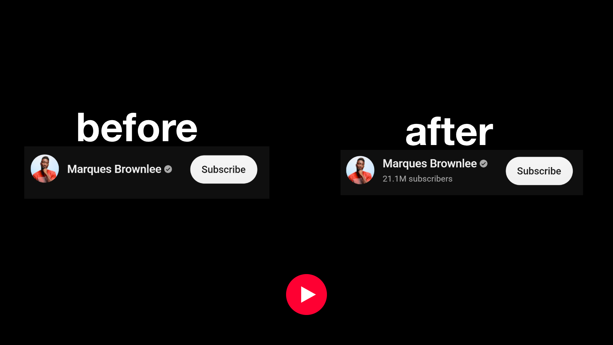
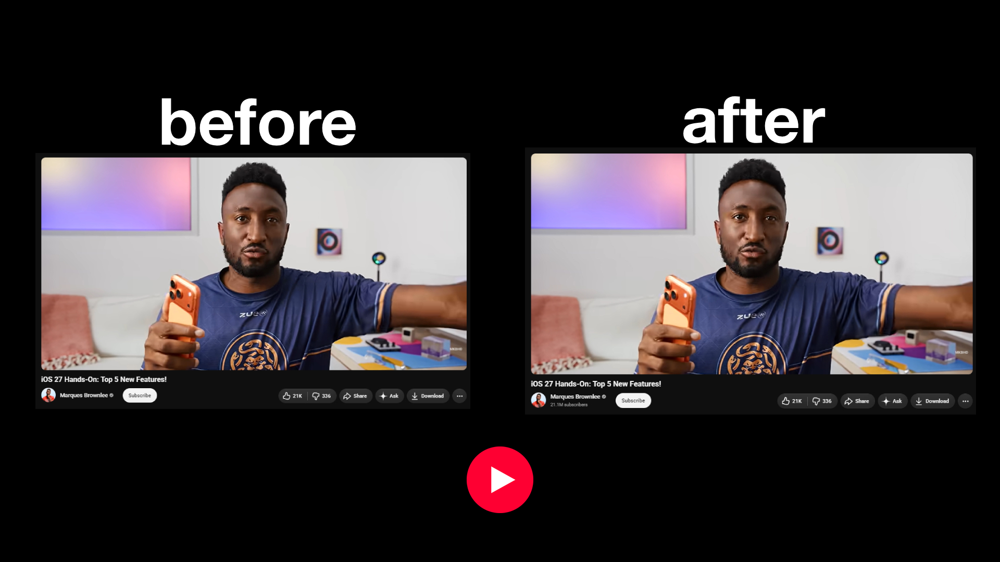

# SubsBack for YouTube

A tiny Chrome extension that shows the subscriber count back under the channel name on YouTube watch pages — since YouTube removed it from the default UI.

## What it does

- Reads the channel link on the video you're watching
- Grabs the subscriber count from the channel's own page (or reuses YouTube's hidden count when available)
- Displays it under the channel name, styled to match YouTube's native look

No accounts, no tracking, no data collection. It only reads public subscriber counts.

## Install

1. Download or clone this repo
2. Go to `chrome://extensions`
3. Turn on **Developer mode** (top right)
4. Click **Load unpacked** and select the extension folder

## Usage

Click the extension icon to toggle it on/off. That's it — subscriber counts show automatically under channel names while browsing YouTube.

## Permissions

- `storage` — saves your on/off toggle locally
- `youtube.com` — needed to read the channel link and fetch the subscriber count

## License

MIT

